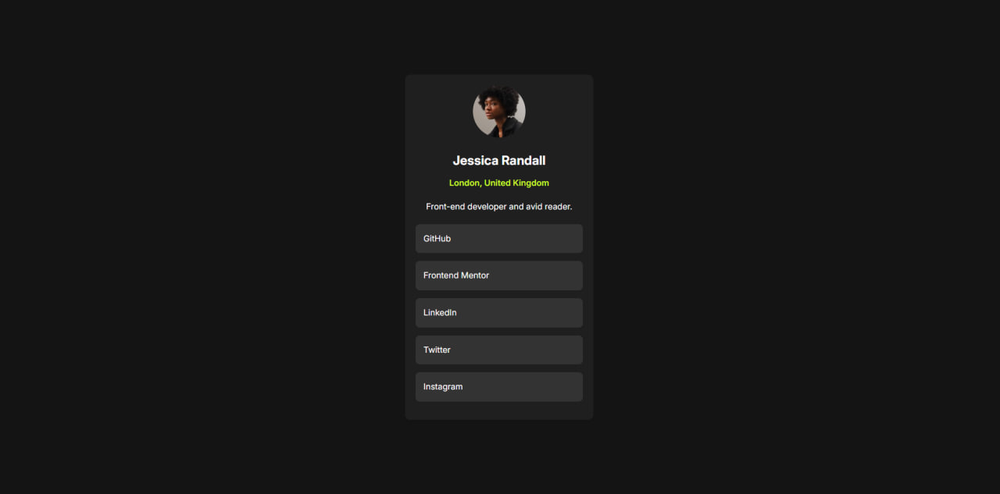
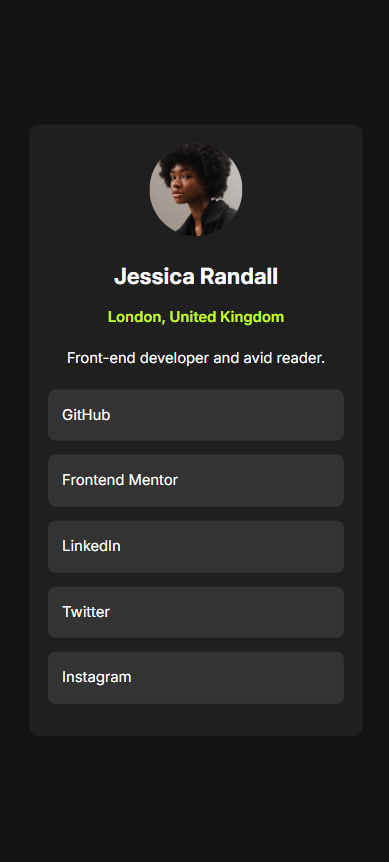

# Frontend Mentor - Social Links Profile Solution

This is my solution to the Social Links Profile challenge on Frontend Mentor. The goal of this project was to recreate a responsive social profile card while practicing HTML, CSS, Flexbox, responsive design, and debugging techniques.

## Table of Contents

- [Overview](#overview)
  - [Screenshot](#screenshot)
  - [Links](#links)
- [My Process](#my-process)
  - [Built With](#built-with)
  - [Features](#features)
  - [Challenges](#challenges)
  - [What I Learned](#what-i-learned)
  - [Continued Development](#continued-development)
  - [AI Collaboration](#ai-collaboration)
- [Author](#author)

## Overview

### Screenshot

**Desktop:**


**Mobile:**


### Links

- Live Site URL: [Add live site URL here]

## My Process

Before writing any code, I downloaded the starter files and carefully studied the design provided by Frontend Mentor.

I started by breaking the design into logical sections:

- Card container
- Profile image
- Name and location
- Description text
- Social links

After planning the structure, I created the HTML markup and focused on building a clean and readable component hierarchy.

Once the structure was complete, I styled the component using CSS. I used Flexbox to center the card on the page and worked on spacing, typography, colors, and interactive hover states.

During development, I regularly tested the layout using browser DevTools and responsive mode to ensure the design remained visually consistent across different screen sizes.

## Built With

- Semantic HTML5
- CSS3
- Flexbox
- Responsive Design
- CSS Transitions
- Google Fonts (Inter)

## Features

- Responsive social profile card
- Mobile-friendly layout
- Interactive social links
- Smooth hover animations
- Flexbox-based layout
- Clean and maintainable code structure

## Challenges

One of the biggest challenges during development was understanding how Flexbox alignment affects child elements.

At one point, I centered all elements using:

```css
.container {
    align-items: center;
}
```

This unexpectedly caused the social link buttons to become narrower because Flexbox stopped stretching child elements across the available width.

After investigating the issue with DevTools, I learned that I only needed to center the profile image:

```css
.profile__image {
    align-self: center;
}
```

This allowed me to keep the image centered while preserving the full width of the social links.

Another challenge was understanding why the card appeared larger than expected on mobile screens.

Initially, I assumed there was a problem with the card width itself. After inspecting the layout using browser DevTools, I realized that the card was being correctly centered inside a larger viewport, and the spacing I was seeing came from the available screen width rather than from the component itself.

This helped me better understand how viewport dimensions, width, max-width, and Flexbox centering work together when building responsive layouts.

## What I Learned

This project helped me strengthen my understanding of several core front-end concepts:

- Building layouts with Flexbox
- Understanding the difference between `align-items` and `align-self`
- Creating hover animations using `transition`
- Structuring components logically
- Working with responsive layouts
- Debugging UI issues using browser DevTools
- Understanding how width and viewport size affect responsive design

Example of a hover animation used in the project:

```css
.social__card-link {
    transition:
        background-color 0.25s ease,
        color 0.25s ease,
        transform 0.25s ease;
}

.social__card-link:hover {
    background-color: hsl(75, 94%, 57%);
    color: hsl(0, 0%, 8%);
    transform: translateY(-2px);
}
```

One of the most valuable lessons from this project was realizing that understanding why a layout breaks is more important than simply memorizing CSS properties.

## Continued Development

In future projects, I want to continue improving:

- Responsive design techniques
- CSS architecture and organization
- Accessibility (a11y)
- CSS animations and transitions
- JavaScript fundamentals
- React development

My current goal is to complete more Frontend Mentor challenges and gradually build a strong front-end development portfolio.

## AI Collaboration

For this project, I used ChatGPT as a learning assistant rather than a code generator.

AI helped me:

- Understand Flexbox behavior
- Learn responsive design principles
- Debug layout issues
- Improve hover animations
- Better understand CSS best practices
- Review and improve code organization

The most valuable part of using AI was receiving explanations that helped me understand why a solution works instead of simply copying code.

## Author

- GitHub - [Mrac3k](https://github.com/Mrac3k)
- Frontend Mentor - [@Mrac3k](https://www.frontendmentor.io/profile/Mrac3k)

---

Built as part of my journey to become a front-end developer.
